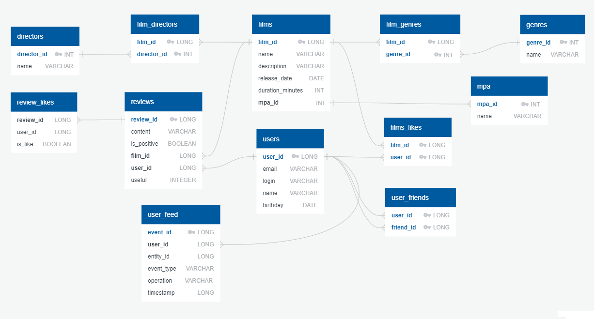

# Filmorate

You can imagine that you are planning to unwind and enjoy an evening watching a film. You have your favorite blanket on a cozy armchair, and a delicious meal is being prepared for you. However, with so many films to choose from, it can be overwhelming to make a decision. The number of movies available seems to increase every year, making the selection process even more challenging. Fortunately, there is no need to despair!

Filmorate is a movie recommendation service that uses user ratings to suggest the top five films that are worth watching. With this service, neither you nor your friends will have to spend a long time wondering what to watch in the evening.

## Application features

Filmorate is a REST API application that implements the following functionality:

- create, update or delete films and users
- add users to friends, view common friends with other users
- search for movies by certain criteria
- write reviews for films, mark reviews as useful/useless
- get films recommended to the user based on ratings
- get top-10 films
- get a list of popular movies for a certain year or genre
- view the user's event feed

## Implemented endpoints

 
 
<h3>Users</h3>

- **GET** /users - get a list of all users
- **GET** /users/{userId} - get information about a user by his id
- **POST** /users - create user
- **PUT** /users - edit user
- **PUT** /users/{id}/friends/{friendId} - add to friends
- **DELETE** /users/{id}/friends/{friendId} - remove from friends
- **DELETE** /users/{userId} - delete user
- **GET** /users/{id}/friends - get list of friends
- **GET** /users/{id}/friends/common/{otherId} - get common friends with other user
- **GET** /users/{id}/feed - get user's feed.

  
<h3>Films</h3>

- **GET** /films - get a list of all films
- **GET** /films/{filmId} - get information about a film by its id
- **POST** /films - create film
- **PUT** /films - edit film
- **PUT** /films/{id}/like/{userId} - user likes the film
- **DELETE** /films/{id}/like/{userId} - user removes like from film
- **DELETE** /films/{filmId} - delete film
- **GET** /films/popular?count={count} - get a list of the first {count} films by the number of likes
- **GET** /films/common?userId={userId}&friendId={friendId} - get a list of films sorted by popularity.
- **GET** /films/search?query={query}&by={by} - get a list of movies with certain parameters

  
<h3>Genres</h3>

- **GET** /genres - get a list of all genres
- **GET** /genres/{id} - get information about a genre by its id

  
<h3>Ratings</h3>

- **GET** /mpa - get a list of all ratings
- **GET** /mpa/{id} - get information about the rating by its id

  
<h3>Recommendations</h3>

- **GET** /users/{id}/recommendations - get recommended films

  
<h3>Review</h3>

- **GET** /reviews - geta list of all reviews
- **GET** /reviews/{reviewId} - get information about a review by its id
- **POST** /reviews - create review
- **PUT** /reviews - edit review
- **PUT** /reviews/{reviewId}/{isPositive}/{userId} - user add like/dislike to the review
- **DELETE** /reviews/{reviewId}/{isPositive}/{userId} — user remove like/dislike from the review
- **DELETE** /reviews/{reviewId} — delete review

  
<h3>Directors</h3>

- **GET** /directors - get list of all directors
- **GET** /directors/{id} - get information about a director by its id
- **POST** /directors - create director
- **PUT** /directors - edit director
- **DELETE** /directors/{id} — delete director

## Database diagram

## Technologies used

- Java 11
- Spring Boot
- Spring Data (JDBC)
- H2 database
- JUnit 5
- Lombok
